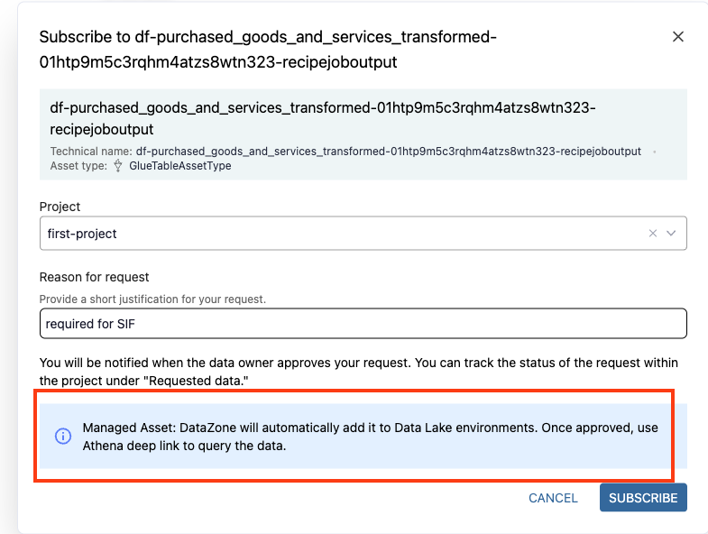

# Guidance for Sustainability Data Management on AWS

## Table of Contents
1. [Overview](#overview)
2. [Prerequisites](#prerequisites)
3. [Deployment Steps & Validation](#deployment-steps-and-validation)
5. [Running the Guidance](#running-the-guidance)
6. [Next Steps](#next-steps)
7. [Cleanup](#cleanup)

## Overview
The Guidance for Sustainability Data Management on AWS is an opinionated sustainability lens built on top of the [Guidance for Data Fabric on AWS](https://github.com/aws-solutions-library-samples/guidance-for-data-fabric-on-aws).

## Prerequisites

### Operating System

These deployment instructions are intended for use on MacOS. Deployment using a different operating system may require additional steps.

### Third-Party tools

1. [Rush](https://rushjs.io/)
2. [Node](https://nodejs.org/en/learn/getting-started/introduction-to-nodejs) 20

### AWS Account Requirements

1. Deploy the Guidance for Data Fabric sample code. See [Guidance for Data Fabric on AWS](https://github.com/aws-solutions-library-samples/guidance-for-data-fabric-on-aws) for instructions.
2. Create an IAM Role in the hub account that can be assumed principal spoke account (where SIF is deployed). You can assign the managed policy `AmazonDataZoneFullUserAcces` to the IAM role.
3. Deploy the Guidance for Sustainability Insights Framework sample code. See steps [here](https://github.com/aws-solutions-library-samples/guidance-for-aws-sustainability-insights-framework/blob/main/docs/deployment/cdk_walkthrough.md).
    1. Clone GitHub repo `git clone git@github.com:aws-solutions-library-samples/guidance-for-aws-sustainability-insights-framework.git`
    2. Change into directory `cd guidance-for-aws-sustainability-insights-framework`
    3. Install dependencies `rush update --bypass-policy`
    4. Build `rush build`
    5. Change into platform infrastructure directory `cd infrastructure/platform`
    6. [Export credentials and the AWS region to the environment](https://docs.aws.amazon.com/cli/latest/userguide/cli-configure-envvars.html)
    7. Deploy platform (can choose appropriate environment) `npm run cdk — deploy -c environment=dev -c clusterDeletionProtection=false -c includeCaml=true --all --require-approval never --concurrency=5`
    8. Change into tenant infrastructure directory `cd ../tenant`
    9. Deploy tenant (can choose appropriate tenantId) by running the command below:
    ```shell
    npm run cdk -- deploy -c tenantId=<tenantId> -c environment=<SIF_ENVIRONMENT> -c administratorEmail=<ADMIN_EMAIL> \
     -c enableDeleteResource=true -c deleteBucket=true -c includeCaml=true \
     -c idcEmail=<idcEmail> -c idcUserId=<idcUserId> -c dfSustainabilityRoleArn=<dfSustainabilityRoleArn> \
     -c dataFabricRegion=<dataFabricRegion> -c dataFabricEventBusArn=<dataFabricEventBusArn> \
     --all --require-approval never --concurrency=10
    ```
    10. Change admin password `cd ../../typescript/packages/integrationTests && ``npm run generate:token -- <tenantId> <SIF_ENVIRONMENT> <ADMIN_EMAIL> 'temporary password' 'new password'`

### AWS CDK Bootstrap

The hub and spoke accounts must be [bootstrapped](https://docs.aws.amazon.com/cdk/v2/guide/bootstrapping.html) for the [AWS Cloud Development Kit](https://docs.aws.amazon.com/cdk/v2/guide/getting_started.html). The spoke account must be bootstrapped to trust the hub account.

1. `cdk bootstrap <HUB_ACCOUNT_ID>/<REGION> --profile <HUB_PROFILE>`
2. `cdk bootstrap <SPOKE_ACCOUNT_ID>/<REGION> --trust <HUB_ACCOUNT_ID> --cloudformation-execution-policies=arn:aws:iam::aws:policy/AdministratorAccess --profile <SPOKE_PROFILE>`

### Service limits

1. Go to **Service Quotas** in the AWS Console. Navigate to Glue DataBrew and request a service quota increase to 50 for **Concurrent jobs per AWS account** (Quota code L-935D4120).

## Deployment Steps and Validation

### Prerequisites

1. `git clone git@github.com:aws-solutions-library-samples/guidance-for-sustainability-data-fabric-on-aws.git`
2. `cd guidance-for-sustainability-data-fabric-on-aws`
3. Install dependencies `rush update --bypass-policy`
4. Build `rush build`
5. `cd infrastructure`
6. [Export credentials for the hub account and the AWS region to the environment](https://docs.aws.amazon.com/cli/latest/userguide/cli-configure-envvars.html)

Run the following seeding step inside the `infrastructure` folder.

### Seeding Product and Pipelines

Run the command below to seed the data fabric products and SIF pipeline resources.

```shell
npm run cdk -- deploy -c hubAccountId=<HUB_ACCOUNT_ID> \
-c spokeAccountId=<SPOKE_ACCOUNT_ID> -c domainId=<DATAZONE_DOMAIN_ID> \
-c domainName=<DATAZONE_DOMAIN_NAME> -c projectId=<DATAZONE_PROJECT_ID> \
-c athenaEnvironmentId=<DATAZONE_DATA_LAKE_ENV_ID> -c redshiftEnvironmentId=<DATAZONE_DATA_WAREHOUSE_ENV_ID> \
-c roleArn=<SERVICE_ROLE_ARN> -c environment=<SIF_ENV> -c tenantId=<SIF_TENANT_ID> \
-c sifAdminEmailAddress=<SIF_ADMIN_EMAIL> -c sdfAdminUserId=<IAM_IDENTITY_CENTER_USERNAME> \
-—require-approval never -—concurrency=10 SdfHubDemoStack SdfHubProductStack
```

### Products and Pipelines Deployment Validation

1. Check that the following CloudFormation stacks have been successfully created:
	1. Hub account
		1. `sdf-common-hub`
		2. `sdf-products-hub`
		3. `sdf-demo-spoke`
	2. Spoke account
        1. `sdf-common-spoke`
        2. `sdf-products-spoke`
        3. `sdf-demo-spoke`
2. Check that the Step Functions have completed successfully.
    1. Go to the AWS Console in the hub account and look at the `df-data-asset` State Machine in AWS Step Functions. You should see about 30 successful executions.
    2. Go to the AWS Console in the spoke account and look at the `df-spoke-data-asset` State Machine in AWS Step Functions. You should see about 30 successful executions.
3. In the DataZone Portal UI, enter the following text `df-purchased_goods_and_services_transformed` on the search bar and click enter, you should see `df-purchased_goods_and_services_transformed-<generated_id>-recipejoboutput` asset. Click on the `SUBSCRIBE` button.<br/>

4. The subscription process will allow the dataset to be queryable by SIF pipeline execution. In the steps above, SIF has been configured to assume a role in the hub account that has DataZone policy.<br/>


### Seeding Impacts and Pipeline Execution

Run the command below to seed the SIF impact factor resources and start the execution of the `ghg:scope_3:purchased_goods_and_services` pipeline.

```shell
npm run cdk -- deploy -c hubAccountId=<HUB_ACCOUNT_ID> \
-c spokeAccountId=<SPOKE_ACCOUNT_ID> -c domainId=<DATAZONE_DOMAIN_ID> \
-c domainName=<DATAZONE_DOMAIN_NAME> -c projectId=<DATAZONE_PROJECT_ID> \
-c athenaEnvironmentId=<DATAZONE_DATA_LAKE_ENV_ID> -c redshiftEnvironmentId=<DATAZONE_DATA_WAREHOUSE_ENV_ID> \
-c roleArn=<SERVICE_ROLE_ARN> -c environment=<SIF_ENV> -c tenantId=<SIF_TENANT_ID> \
-c sifAdminEmailAddress=<SIF_ADMIN_EMAIL> -c sdfAdminUserId=<IAM_IDENTITY_CENTER_USERNAME> \
—require-approval never —concurrency=10 SdfHubWorkflowStack
```

### Impacts and Pipelines Execution Validation

1. Check that the following CloudFormation stack `sdf-workflow-spoke` have been successfully created in the spoke account.
2. Check that the Step Functions have completed successfully.
    1. Go to the AWS Console in the spoke account and look at the `sdf-demo-seeder` State Machine in AWS Step Functions. You should see 1 successful execution, this should create all the impact factors and trigger the `ghg:scope_3:purchased_goods_and_services` pipeline.
    2. Go to the AWS Console in the spoke account and look at the `sif-demo-dev-activityPipelineSM` State Machine in AWS Step Functions. You should see 1 successful execution, at the end of the pipeline execution, it will trigger the registration of the pipeline and metric output in DataZone.
3. Go to the DataZone Portal UI and verify that the pipeline execution activity (`df-ghg:scope_3:purchased_goods_and_services-<generated_id>-pipeline_<pipeline_id>`) and metric (`df-sustainability_insight_framework_metrics-<generated_id>-metrics`) output have been published as an asset.
4. In the DataZone Portal UI, subscribes to these assets.
5. Go to the DataZone environment, click on `data-lake environment` and `Query data`,
6. This should redirect you to the Amazon Athena Query Editor, select `df-spoke-<aws_account_id>-<aws_region>` on the Database drop down box, you should see the 2 tables that you had just subscribed.
7. You can now query data from these tables using Amazon Athena.
8. Retrieve the OpenLineage web application url, but going to the CloudFormation console and select `df-hub-datalineage` and click on the `Outputs` tab.
9. Click on the **HTTPS** URL, it should redirect you to Amazon Cognito login page. Login using the administrator email that you specified previously when deploying the Data Fabric solution.

## Running the Guidance

Everything should run automatically after deployment completes. You can now navigate to the DataZone UI and explore the assets that have been created. If you don’t see all assets in the DataZone catalog, try rerunning the deployment steps.

## Next Steps

1. See the next steps of the Guidance for Data Fabric on AWS to learn more about general next steps.

## Cleanup

1. Go to the AWS Console and delete all CloudFormation stacks prefixed by `sdf` in the hub and spoke accounts.
2. Clean up SIF as described in the [documentation](https://github.com/aws-solutions-library-samples/guidance-for-aws-sustainability-insights-framework/blob/main/docs/deployment/cli_walkthrough.md#tear-down).

## Notices

*Customers are responsible for making their own independent assessment of the information in this Guidance. This Guidance: (a) is for informational purposes only, (b) represents AWS current product offerings and practices, which are subject to change without notice, and (c) does not create any commitments or assurances from AWS and its affiliates, suppliers or licensors. AWS products or services are provided “as is” without warranties, representations, or conditions of any kind, whether express or implied. AWS responsibilities and liabilities to its customers are controlled by AWS agreements, and this Guidance is not part of, nor does it modify, any agreement between AWS and its customers.*
